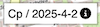

# 🌍 Geo-assistant v1.0
[https://vidkein.github.io/Geo-assistant-v1.0/](https://vidkein.github.io/Geo-assistant-v1.0/)

🗺️ Multi-language README:  
[🇬🇧 English](#english) | [🇨🇿 Czech](#czech) | [🇺🇦 Ukrainian](#ukrainian)

---

## English

**Geo-assistant** is a tool designed to assist with geodetic surveys. It serves as a testing ground for various technologies. This is an early-stage demo and **not intended for business use**.

### ⚠️ Security Notice
- No database used — data is stored in JSON files.
- Authentication is done **on the client side** — not secure.

### 📌 Features
- User authentication (client-side).
- Manage geodetic points (stored in [koordinats.json](#Data)):
  - Point number
  - Location (e.g., SOD-11)
  - Placement type (asphalt, pipe, wall, etc.)
  - Coordinates
  - Coordinate system
  - Elevation
  - Date added
- Forming a work plan using tables (Jobs_kalendar.xlsx)
- Converting coordinates JTSK → WGS84
- Determining the current location
- Working with points
- Working with point types

### 🌍 Functional


### Layers on the map
#### - Map:
  1. Base
  2. Satellite
#### - Folders:
  1. Base
  2. Working
#### - Point information (appears when you click on the folder):
  1. Number
  2. Point height
  3. Location type
  4. Switch - measured/not measured


### Map zoom buttons


### Positioning button

When geolocation is enabled, the location point is a blue circle (with a direction arrow - depends on the phone)


### Calendar:

Displays a calendar with measurement plans (total station/leveling). When initially loaded or a date selected, the calendar displays the date and information by work location (displaying the number of points).


### Settings:
  1. General settings:
     * Site display language
     * Choose whether to display the point number or not
     * Reset all general settings
  2. Import work calendar

  RULES FOR COMPLETING THE WORK PLAN TABLE:
  - COLUMN A - fill in any
  - COLUMN B - point number (filling options number 141801 or extenso EXT-306(480901), EXT-336(550401))
  - COLUMN C - type of work (filling options with a letter (type of work n-level survey, t-tacheometric survey))
  3. Name of the work location:
     * Add
     * Delete
  4. Working with points:
     * Adding
     * Editing
     * Deleting
  5. Point type codes/coordinate system:
     * Adding
     * Deleting
  6. Importing points as a list

  Importing a list of points using .csv, .txt format files. 

  EXAMPLE OF COLUMN ARRANGEMENT SEPARATOR ";"

  ```txt

     Number|      X    |      Y     |   H    |   date   |systemCoordinates|positionType
      1;     741976.7448;1047497.7509;268.1013;25-05-25;         1;           12
  
  ```
  
  7. Exmporting points as a list

  Exporting a list of points in .csv, .txt format. 

  8. Log out  
### Symbols:
  - POINTS:
    * Basic:
      1. leveling - green triangle
      2. tacheometric - blue crossed-out circle
    * Working:
      1. leveling - green circle with the letter H inside
      2. tacheometric - green circle with the letter T inside
  - A checkmark, which means that the point is measured or oriented


### Information by date 
Displays the day of the week and date. When clicked, information about the date selected in the calendar is displayed.
### Scale bar - meters/km depending on the scale
### Help - link in the far right corner

When clicked, opens the help page for working with the program (depending on the selected site display language).

---

## Czech

**Geo-assistant** je aplikace pro usnadnění geodetických prací. Slouží k testování různých technologií. Jde o demonstrační verzi **nevhodnou pro komerční použití**.

### ⚠️ Upozornění na bezpečnost
- Data nejsou v databázi — uloženo v JSON.
- Ověření uživatele probíhá **na straně klienta** — není bezpečné.

### 📌 Funkce
- Přihlášení uživatele
- Práce s body (soubor [koordinats.json](#Data)):
  - Číslo bodu
  - Název lokality (SOD-11 atd.)
  - Typ umístění
  - Souřadnice
  - Systém souřadnic
  - Výška
  - Datum
- Vytvoření pracovního plánu pomocí tabulek (Jobs_kalendar.xlsx)
- Převod souřadnic JTSK → WGS84
- Určení aktuální polohy
- Práce s body
- Práce s typy bodů


### 🌍 Funkční


### Vrstvy na mapě
#### - Mapě:
  1. Základní
  2. Satelitní
 #### - Body:
  1. Základní
  2. Pracovní
 #### - Informace o bodech (zobrazí se po kliknutí na složku):
  1. Číslo
  2. Výška bodu
  3. Typ umístění
  4. Přepínač Měřeno/neměřeno


### Tlačítka přiblížení mapy


### Polohovací tlačítko

Pokud je povolena geolokace, bod polohy je modrý kruh (se směrovou šipkou - záleží na telefonu)


### Kalendář:

Zobrazí se kalendář s plány měření (totální stanice/nivelace). Při prvním načtení nebo výběru data se v kalendáři zobrazí datum a informace podle pracoviště (zobrazení počtu bodů).


### Nastavení:
  1. Obecná nastavení:
     * Jazyk zobrazení webu
     * Výběr, zda se má zobrazovat číslo bodu
     * Obnovení všech obecných nastavení
  2. Import pracovního kalendáře
  
  PRAVIDLA PRO VYPLNĚNÍ TABULKY PRACOVNÍHO PLÁNU:
  - SLOUPEC A - vyplňte libovolné
  - SLOUPEC B - číslo bodu (možnosti vyplnění číslo 141801 nebo extenso EXT-306(480901), EXT-336(550401))
  - SLOUPEC C - druh práce (možnosti vyplnění písmenem (druh práce n-úrovňové zaměření, t-tachyometrické zaměření))
  3. Název pracoviště:
     * Přidávání
     * Mazání
  4. Práce s body:
     * Přidávání
     * Úpravy
     * Mazání
  5. Kódy typů bodů/souřadnicový systém:
     * Přidávání
     * Mazání
  6. Import bodů jako seznamu

  Import seznamu bodů pomocí souborů .csv, .txt. 

  PŘÍKLAD ODDĚLOVAČE USPOŘÁDÁNÍ SLOUPCŮ ";"

  ```txt

     Number|      X    |      Y     |   H    |   date   |systemCoordinates|positionType
      1;     741976.7448;1047497.7509;268.1013;25-05-25;         1;           12
  
  ```
  7. Export bodů jako seznamu

  Export seznamu bodů ve formátu .csv, .txt.

  8. Odhlaste se   
### Symboly:
- BODY:
  * Základní:
    1. nivelace - zelený trojúhelník
    2. tachyometrie - modrý přeškrtnutý kruh
  * Pracovní:
    1. nivelace - zelený kruh s písmenem H uvnitř
    2. tachyometrie - zelený kruh s písmenem T uvnitř
- Zaškrtávací značka označující, že bod je změřen nebo orientován


### Informace podle data
Zobrazuje den v týdnu a datum. Po stisknutí se zobrazí informace o datu vybraném v kalendáři.
### Měřítko - metry/km v závislosti na měřítku
### Nápověda - odkaz v pravém rohu

Po kliknutí se otevře stránka s nápovědou pro práci s programem (v závislosti na zvoleném jazyce zobrazení webu).

---

## Ukrainian

**Geo-assistant** — це інструмент для оптимізації геодезичних робіт. Проєкт створено для тестування різних технологій. Це демонстраційна версія і **не призначена для комерційного використання**.

### ⚠️ Попередження щодо безпеки
- Дані зберігаються в JSON-файлах, без бази даних.
- Аутентифікація — **на стороні клієнта**, що небезпечно.

### 📌 Можливості
- Аутентифікація користувача
- Робота з точками ([koordinats.json](#Data)):
  - Номер
  - Назва ділянки (SOD-11...)
  - Тип розміщення
  - Координати
  - Система координат
  - Висота
  - Дата
- Формування плану роботи за допомогою таблиць (Jobs_kalendar.xlsx)
- Перетворення координат JTSK → WGS84
- Визначення поточного місцезнаходження
- Робота з точками
- Робота з типами точок

### 🌍 Функціонал


### Шари на картi
#### - Мапа:
  1. Базова
  2. Супутникова
 #### - Течки:
  1. Базовi
  2. Рабочi
 #### - Інформація по точках (з'являється при натисканні на течку):
  1. Номер
  2. Висота точки
  3. Тип розташування
  4. Переключатель - виміряно/не виміряно


### Кнопки масштабування картки


### Кнопка позиціонування

При включенні геолокації точка розташування – блакитне коло (зі стрілкою вказівної напрямки – залежить від телефону)


### Календар:

Відображається календар із планами вимірювання (тахеометрія/нівелювання). При початковому завантаженні або виборі дати на календарі відображається дата та інформація за місцями роботи (відображенням кількості точок).


### Налаштування:
  1. Загальні налаштування:
      * Мова відображення сайту
      * Вибір відображення номера точки чи ні
      * Скидання всіх загальних налаштувань
  2. Імпорт календаря работ

  ПРАВИЛА ЗАПОВНЕННЯ ТАБЛИЦІ ПЛАНУ ВИКОНАННЯ РОБОТ:
  - СТОВПЕЦ А - заповнення будь-яке
  - СТОВПЕЦ Б - номер точки (варіанти заповнення число 141801 або екстензо EXT-306(480901), EXT-336(550401))
  - СТОВПЕЦ В - тип робіт (варіанти заповнення літерою (тип робіт n-нівелірна зйомка, t-тахеометрична зйомка))
  3. Назва місця розташування робіт:
      * Додавання
      * Видалення
  4. Робота з точками:
      * Додавання
      * Редагування
      * Видалення
  5. Коди типів точок/системи координат:
      * Додавання
      * Видалення
  6. Імпорт точок у вигляді списку
  
  Імпортування списку точок за допомогою файлів формату .csv, .txt. 
  
  ПРИКЛАД РОЗМІЩЕННЯ СТОЛБЧІВ РОЗДІЛЮВАЧ ";"

  ```txt

     Number|      X    |      Y     |   H    |   date   |systemCoordinates|positionType
      1;     741976.7448;1047497.7509;268.1013;25-05-25;         1;           12
  
  ```
  7. Експорт точок у вигляді списку.

  Експортування списку точок в формату .csv, .txt. 

  8. Вийти із реєстрації    
### Умовні позначення:
   - ТОЧКИ:
      * Базові:
        1. нівелювання – зелений трикутник
        2. тахеометричні - синє перекреслене коло
      * Робочі:
        1. нівелювання – зелене коло з буквою всередині Н
        2. тахеометричні - зелене коло з літерою всередині Т
   - Маркер у вигляді галочки, що означає, що точка виміряна або зорієнтована


### Інформація за датою 
Відображає день тижня та дату. При натисканні відображається інформація про дату, вибрану в календарі.
### Масштабна лінійка - метрах/км залежно від масштабу
### Допомога - посилання в крайньому правому кутку

При натисканні відкриває сторінку допомоги для роботи з програмою (залежно від вибраної мови відображення сайту). 

---
## Data
📄 **Data structure (`koordinats.json`)**:

```json
{
  "Base": {
    "trig": {
      "11005": {
        "position": [50.08684, 14.42057],
        "vycka": 268.377,
        "date": "2024-10-27",
        "systemCoordinates": "WGS84",
        "positionType": "pillar-target cross"
      }
    },
    "niv": { "..." }
  },
  "poligons": {
    "SOD-11": { "..." },
    "SOD-12": { "..." },
    "SOD-13": { "..." }
  }
}
```

---

📧 Contact: [VidKein](https://github.com/VidKein) 
📘 License: MIT
